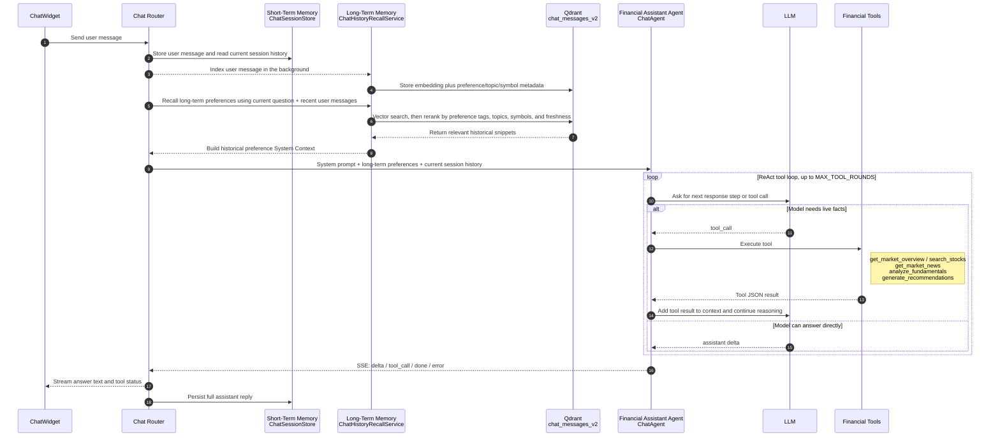

# FinanceHub

FinanceHub is a research and workflow web application for the China market. The frontend is built with **React + Vite + TypeScript**, and the backend is built with **FastAPI**. The backend provides market overview data, index and stock data, LangGraph-based multi-agent investment recommendations, AI chat with conversation memory, fundamental analysis, market news, and watchlist features. Upstream data sources and LLM providers are configured through environment variables.

## Architecture Diagrams

### Multi-Agent Recommendation System

Core collaboration model: `RecommendationGraphRuntime` uses LangGraph to maintain shared state. Each agent owns one decision step, writes structured output back into the graph state, and hands that state to the next agent.

```mermaid
sequenceDiagram
    autonumber
    participant UI as Recommendation UI
    participant API as FastAPI Recommendation API
    participant G as LangGraph Shared State
    participant P as User Profile Agent
    participant M as Market Intelligence Agent
    participant R as Product Match Agent
    participant C as Compliance Risk Agent
    participant GM as Manager Coordinator Agent
    participant OUT as Response Assembler

    UI->>API: Submit risk survey, holdings, transactions, and user intent
    API->>G: Create RecommendationGraphState

    Note over P,GM: RecommendationAgentRuntime calls the LLM and records agentTrace

    G->>P: Questionnaire profile + user intent + recalled chat preferences
    Note right of P: ChatHistoryRecallService adds long-term preference memory
    P-->>G: Risk tier, liquidity need, horizon, drawdown sensitivity

    G->>M: Profile insights + market data request
    Note right of M: MarketDataService and MarketNewsService provide market evidence
    M-->>G: Market sentiment, allocation stance, preferred and avoided categories

    G->>R: Profile + market stance + candidate product pool
    Note right of R: PrefetchedCandidateRepository provides stock/fund/wealth candidates; product Qdrant knowledge adds evidence
    R-->>G: Recommended candidates, ranking, product rationale

    G->>C: Candidate basket + user risk tier + product evidence
    Note right of C: Compliance Qdrant knowledge and ComplianceFactsService check suitability
    C-->>G: Compliance verdict approve / limited / blocked

    alt approve or limited
        G->>GM: Summarize profile, market, products, and compliance review
        GM-->>G: Final portfolio narrative, whyThisPlan, risk disclosures
    else blocked
        G->>GM: Summarize blocking reason
        GM-->>G: Manual review message and blocked response
    end

    G->>OUT: Build RecommendationResponse
    OUT-->>UI: Return portfolio, explanations, disclosures, and agentTrace
```

### Financial Assistant System

Core collaboration model: before every reply, `ChatAgent` combines short-term session history with long-term preference memory, then runs a ReAct loop. When the model needs facts, it requests tool calls; tool results are written back into the context, reasoning continues, and the final answer streams back through SSE while the assistant message is persisted.



## Repository Structure

| Path | Description |
|------|-------------|
| `index.html` | SPA entry point |
| `src/` | Frontend application (React + TypeScript) |
| `vite.config.ts` | Vite configuration, including the `/api` proxy |
| `backend/financehub_market_api/` | Backend Python package (FastAPI application) |
| `backend/scripts/` | Data seeding and scheduled job scripts |
| `backend/tests/` | Backend unit and integration tests |
| `backend/pyproject.toml` | Backend dependency and build configuration |

## Requirements

- **Node.js**: use the current LTS release for the frontend and Vitest.
- **Python**: `>= 3.11` (see `backend/pyproject.toml`).
- **Local services by feature**: MySQL for users and auth, Redis for market cache and chat sessions, Qdrant plus related API keys for chat recall and knowledge retrieval. If not all services are available, some endpoints may be unavailable. Database tables are created when the API process loads the package; failures are logged and retried later (see `main.py` and its `lifespan` function).

## Environment Variables

When `financehub_market_api` is imported, it merges environment variables from the following files in order. Keys that already exist in the process environment are not overwritten:

1. Repository root: `.env`, `.env.local`
2. `backend/`: `.env`, `.env.local`

Common variables:

| Variable | Purpose |
|----------|---------|
| `FINANCEHUB_MYSQL_URL` | MySQL connection string. The default development placeholder is in `auth/database.py`. |
| `FINANCEHUB_JWT_SECRET_KEY` | JWT signing secret. This must be set in production. |
| `FINANCEHUB_MARKET_CACHE_REDIS_URL` | Redis URL, defaulting to `redis://127.0.0.1:6379/0`. |
| `FINANCEHUB_CHAT_RECALL_QDRANT_URL` | Qdrant HTTP base URL for chat recall and related retrieval features. |
| `FINANCEHUB_LLM_PROVIDER_OPENAI_API_KEY` and related keys | LLM and embedding configuration. See the integration test setup for the full matrix. |

You can copy and edit `.env.local` under `backend/` for local development. Do not commit secrets.

## Running Locally

### 1. Backend (FastAPI)

After preparing `.env` / `.env.local` in the repository root or under `backend/`:

```bash
cd backend
python -m venv .venv
source .venv/bin/activate   # Windows: .venv\Scripts\activate
pip install -e ".[dev]"
uvicorn financehub_market_api.main:app --reload --host 127.0.0.1 --port 8010
```

The default API server listens on **http://127.0.0.1:8010** to avoid conflicts with other local services that commonly use **8000**. Interactive API documentation is available at **http://127.0.0.1:8010/docs**.

If you must run the backend on **8000**, create `.env.development.local` in the repository root, set `VITE_FINANCEHUB_API=http://127.0.0.1:8000`, and point the frontend proxy at the same address.

### 2. Seed Vector Data (First Deployment)

Chat recall, product knowledge, and compliance knowledge depend on Qdrant vector collections. On first deployment, run the seed scripts from `backend/` with the virtual environment activated:

```bash
python -m scripts.seed_chat_messages_collection
python -m scripts.seed_product_knowledge_collection
python -m scripts.seed_compliance_knowledge_collection
```

Refresh the recommendation candidate pool:

```bash
python -m scripts.refresh_recommendation_candidate_pool
```

After the backend starts, it automatically schedules recommendation candidate pool refresh jobs:

- `stock`: refresh every 10 minutes
- `fund`: refresh every 60 minutes
- `wealth_management`: refresh every 60 minutes

The first startup runs an immediate refresh by default. You can disable or tune the scheduler with:

- `FINANCEHUB_RECOMMENDATION_REFRESH_ENABLED`
- `FINANCEHUB_RECOMMENDATION_REFRESH_RUN_ON_STARTUP`
- `FINANCEHUB_RECOMMENDATION_REFRESH_STOCK_INTERVAL_SECONDS`
- `FINANCEHUB_RECOMMENDATION_REFRESH_FUND_INTERVAL_SECONDS`
- `FINANCEHUB_RECOMMENDATION_REFRESH_WEALTH_INTERVAL_SECONDS`

The manual scripts remain useful for backfills and debugging.

### 3. Frontend (Vite)

In another terminal:

```bash
npm install
npm run dev
```

The development server proxies requests beginning with **`/api`** to **`VITE_FINANCEHUB_API`**. The default value is defined in the repository-root `.env.development` and is currently **http://127.0.0.1:8010**. Start the backend first and keep the ports aligned so the frontend can call login, market data, recommendation, chat, and related endpoints.

Production build and preview:

```bash
npm run build
npm run preview
```

## Testing

```bash
# Frontend
npm test

# Backend (from backend/ with the virtual environment activated)
pytest
```

Optional integration smoke tests that use real MySQL, Redis, Qdrant, OpenAI, and related services are documented at the top of `backend/tests/test_smoke.py` and guarded by `FINANCEHUB_INTEGRATION_TESTS`.

## Backend Module Overview

| Module | Responsibility |
|--------|----------------|
| `auth/` | User registration, login, and JWT authentication |
| `chat/` | AI chat sessions, message storage, and historical recall |
| `recommendation/` | Multi-agent investment recommendations powered by LangGraph |
| `fundamental_analysis.py` | Stock fundamental analysis |
| `market_news.py` | Market news aggregation |
| `watchlist.py` | User watchlist |
| `upstreams/` | Upstream data source adapters such as DoltHub and IndexData |
| `cache.py` | Market snapshot cache backed by Redis |

For the complete HTTP contract and models while the API is running, open **http://127.0.0.1:8010/docs** (Swagger).
