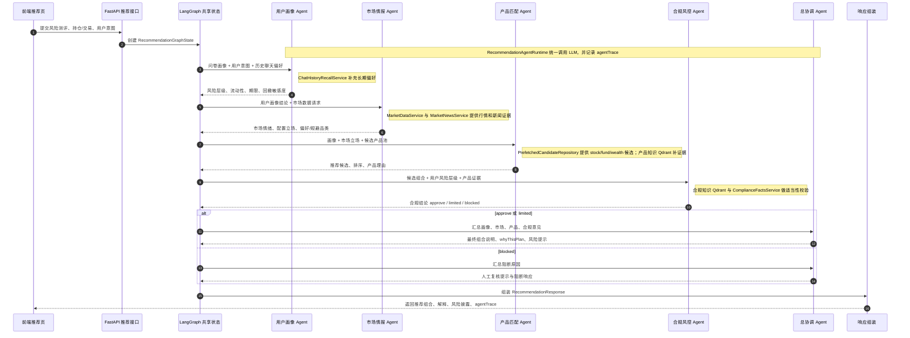
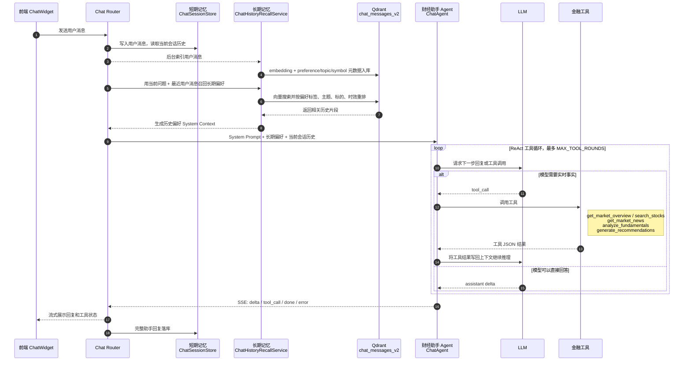

# FinanceHub

FinanceHub 是一个面向中国市场的投研与工具型 Web 应用：**React + Vite + TypeScript** 前端，**FastAPI** 后端。后端提供行情概览、指数与股票数据、基于 LangGraph 的多智能体投顾推荐、带会话记忆的 AI 聊天、基本面分析、市场新闻、自选股等能力；上游数据与 LLM 通过环境变量配置。

## 架构图

### 多 Agent 推荐系统架构图

核心协作方式：`RecommendationGraphRuntime` 用 LangGraph 维护共享状态，每个 Agent 只负责一个判断环节，把结构化结果写回状态后交给下一位 Agent 继续推理。



### 财经助手架构图

核心协作方式：`ChatAgent` 每次回复前先合并短期会话历史和长期偏好记忆，再进入 ReAct 循环；模型需要事实时发起工具调用，工具结果写回上下文后继续推理，最终用 SSE 流式返回并持久化助手回复。



## 仓库结构

| 路径 | 说明 |
|------|------|
| `index.html` | SPA 入口 |
| `src/` | 前端应用（React + TypeScript） |
| `vite.config.ts` | Vite 配置（含 `/api` 代理） |
| `backend/financehub_market_api/` | 后端 Python 包（FastAPI 应用） |
| `backend/scripts/` | 数据种子与定时任务脚本 |
| `backend/tests/` | 后端单元与集成测试 |
| `backend/pyproject.toml` | 后端依赖与构建配置 |

## 环境要求

- **Node.js**：建议当前 LTS，用于前端与 Vitest。
- **Python**：`>= 3.11`（见 `backend/pyproject.toml`）。
- **本地依赖（按功能）**：MySQL（用户与认证）、Redis（市场缓存与聊天会话等）、Qdrant 与相关 API Key（聊天召回等）。未全部就绪时，部分接口可能不可用；数据库表会在 API 进程首次加载包时尝试创建（失败时仅打日志，见 `main.py` 的 `lifespan`）。

## 环境变量

导入 `financehub_market_api` 时会从以下文件**按顺序合并**到进程环境（**已存在于环境中的键不会被覆盖**）：

1. 仓库根目录：`.env`、`.env.local`
2. `backend/`：`.env`、`.env.local`

常用变量示例（具体以后端代码与 `backend/tests/integration_support.py` 为准）：

| 变量 | 作用 |
|------|------|
| `FINANCEHUB_MYSQL_URL` | MySQL 连接串（默认开发占位见 `auth/database.py`） |
| `FINANCEHUB_JWT_SECRET_KEY` | JWT 签发密钥（生产环境务必设置） |
| `FINANCEHUB_MARKET_CACHE_REDIS_URL` | Redis，默认 `redis://127.0.0.1:6379/0` |
| `FINANCEHUB_CHAT_RECALL_QDRANT_URL` | Qdrant HTTP 基地址（聊天召回等） |
| `FINANCEHUB_LLM_PROVIDER_OPENAI_API_KEY` 等 | LLM / 嵌入相关（多路配置，见集成测试说明） |

可在 `backend/` 下复制并编辑 `.env.local`（勿提交密钥）。

## 启动方式

### 1. 后端（FastAPI）

在仓库根目录或 `backend/` 下准备好 `.env` / `.env.local` 后：

```bash
cd backend
python -m venv .venv
source .venv/bin/activate   # Windows: .venv\Scripts\activate
pip install -e ".[dev]"
uvicorn financehub_market_api.main:app --reload --host 127.0.0.1 --port 8010
```

默认监听 **http://127.0.0.1:8010**（避免与本机其他常用服务抢占 **8000**）。交互式 API 文档：**http://127.0.0.1:8010/docs**。

若必须以 **8000** 启动后端，请在仓库根目录创建 `.env.development.local`，设置 `VITE_FINANCEHUB_API=http://127.0.0.1:8000`，并把前端代理指向同一地址。

### 2. 初始化向量数据（首次）

聊天召回、产品知识库、合规知识库依赖 Qdrant 向量集合，**首次部署时需要运行种子脚本**（在 `backend/` 目录、虚拟环境已激活的状态下）：

```bash
python -m scripts.seed_chat_messages_collection
python -m scripts.seed_product_knowledge_collection
python -m scripts.seed_compliance_knowledge_collection
```

推荐候选池刷新：

```bash
python -m scripts.refresh_recommendation_candidate_pool
```

后端启动后会自动在应用内触发推荐候选池刷新任务：

- `stock`：每 10 分钟刷新一次
- `fund`：每 60 分钟刷新一次
- `wealth_management`：每 60 分钟刷新一次

首次启动默认会立即执行一次刷新。若需要关闭或调整周期，可通过环境变量配置：

- `FINANCEHUB_RECOMMENDATION_REFRESH_ENABLED`
- `FINANCEHUB_RECOMMENDATION_REFRESH_RUN_ON_STARTUP`
- `FINANCEHUB_RECOMMENDATION_REFRESH_STOCK_INTERVAL_SECONDS`
- `FINANCEHUB_RECOMMENDATION_REFRESH_FUND_INTERVAL_SECONDS`
- `FINANCEHUB_RECOMMENDATION_REFRESH_WEALTH_INTERVAL_SECONDS`

上面的脚本仍可用于手动补刷新或排查问题。

### 3. 前端（Vite）

另开终端：

```bash
npm install
npm run dev
```

开发服务器会把以 **`/api` 开头的请求**代理到 **`VITE_FINANCEHUB_API`**（默认见根目录 `.env.development`，现为 **http://127.0.0.1:8010**），因此需先启动后端且端口一致，前端才能正常调用登录、行情、推荐、聊天等接口。

生产构建与预览：

```bash
npm run build
npm run preview
```

## 测试

```bash
# 前端
npm test

# 后端（在 backend/ 且虚拟环境已激活）
pytest
```

可选集成烟测（真实 MySQL / Redis / Qdrant / OpenAI 等）见 `backend/tests/test_smoke.py` 文件顶部的说明与 `FINANCEHUB_INTEGRATION_TESTS` 开关。

## 后端模块概览

| 模块 | 职责 |
|------|------|
| `auth/` | 用户注册、登录、JWT 认证 |
| `chat/` | AI 聊天会话、消息存储、历史召回 |
| `recommendation/` | 多智能体投顾推荐（LangGraph 图） |
| `fundamental_analysis.py` | 个股基本面分析 |
| `market_news.py` | 市场新闻聚合 |
| `watchlist.py` | 用户自选股 |
| `upstreams/` | 上游数据源适配（DoltHub、IndexData 等） |
| `cache.py` | 市场快照缓存（Redis） |

运行中查看完整 HTTP 契约与模型：**http://127.0.0.1:8010/docs**（Swagger）。
