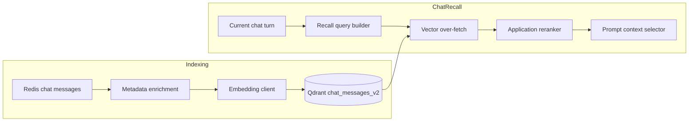

# Chat Recall Quality Upgrade

## Status
Approved for implementation planning.

## Objective
Upgrade the chat assistant's historical memory retrieval so it more reliably recalls previously stated user preferences, ranks context that is more relevant to the current question, and suppresses duplicate or stale snippets before prompt injection.

## Problem
The current chat recall path has been connected for chat delivery, but retrieval quality is still capped by a thin index and a shallow ranking strategy.

Today the system:

- stores only the raw user message content and minimal Qdrant payload
- builds the recall query mostly from the latest user message
- retrieves a small candidate set and returns deduplicated text only
- applies only simple duplicate filtering before injecting the snippets into chat context

This creates three user-visible failure modes:

1. A stable preference that was discussed before is not recalled.
2. Retrieved snippets are semantically related but not specific enough to the current request.
3. Duplicate, repetitive, or stale memories take up prompt budget and dilute useful context.

## Goals
- Improve recall hit rate for previously stated long-term preferences.
- Improve relevance ranking for the current chat turn.
- Reduce duplicate, low-information, and stale historical snippets.
- Keep retrieval user-scoped and avoid leaking data across users.
- Support rebuilding historical chat data into the richer index format.
- Preserve a clear rollback path if the upgraded recall stack underperforms.

## Non-Goals
- Do not introduce a separate long-term memory summary table in this phase.
- Do not index assistant replies into the chat recall collection.
- Do not add frontend UI for memory inspection or recall visualization.
- Do not add LLM-based memory extraction or summarization as a required dependency.

## Confirmed Product Decisions
- Optimization goal: quality first, even if the implementation is broader than a low-risk patch.
- Historical data: existing chat history should be eligible for rebuild into the new index.
- Retrieval architecture: use a richer Qdrant payload plus two-stage retrieval and reranking.
- Migration strategy: build a new collection version and switch to it after verification.
- Recall output: inject only a small number of high-value snippets into the chat prompt.

## Current Architecture Context

### Chat persistence
- `backend/financehub_market_api/chat/store.py`
  - Redis stores chat sessions and per-session message history.
  - The source of truth for historical chat messages remains Redis.

### Current chat vector store
- `backend/financehub_market_api/chat/qdrant_store.py`
  - Qdrant points currently store:
    - `user_id`
    - `session_id`
    - `message_id`
    - `role`
    - `content`
    - `created_at`
  - Search is only filtered by `user_id`.

### Current recall service
- `backend/financehub_market_api/chat/recall_service.py`
  - builds a composite query from:
    - `risk_profile`
    - `user_intent_text`
    - `latest_user_message`
  - embeds that query
  - returns deduplicated snippet text from Qdrant hits

### Current chat injection path
- `backend/financehub_market_api/chat/router.py`
  - stores the current user message
  - indexes the user message best-effort in the background
  - recalls snippets before calling `ChatAgent`
  - injects a temporary system message if filtered snippets remain

### Current collection setup
- `backend/scripts/seed_chat_messages_collection.py`
  - creates the chat collection
  - adds payload indexes for:
    - `user_id`
    - `session_id`
    - `created_at`

## Approaches Considered

### Approach A: Query and ranking tuning only
Keep the current collection schema and improve only query construction, candidate count, and application-side reranking.

Pros:
- Fastest to ship
- No historical rebuild needed
- Lower migration risk

Cons:
- Retrieval ceiling remains limited by thin payload metadata
- Harder to distinguish long-term preferences from generic chat noise
- Limited leverage for stale-content suppression and diversity rules

### Approach B: Rich payload plus two-stage retrieval and reranking
Expand indexed metadata, over-fetch vector candidates, then rerank candidates in application code using semantic score, extracted tags, freshness, density, and diversity constraints.

Pros:
- Best balance of quality gain and implementation risk
- Directly addresses miss, relevance, and duplicate/staleness issues
- Creates a strong foundation for future memory-layer improvements
- Works with a historical rebuild flow

Cons:
- Requires collection versioning, rebuild tooling, and broader tests
- Adds payload extraction and reranking logic

### Approach C: Separate long-term memory layer
Create a second structured memory layer derived from raw chats and retrieve that layer first, using raw messages only as supporting evidence.

Pros:
- Highest long-term quality ceiling
- Strongest protection against repetitive raw-message noise

Cons:
- Significantly larger design and implementation scope
- Requires memory consolidation rules or extra model-based extraction
- Higher operational and maintenance complexity

## Selected Approach
Use Approach B.

This approach gives the largest quality gain that still fits the current repository architecture. It improves both retrieval inputs and post-retrieval ranking without requiring a brand-new memory subsystem.

## High-Level Design



The upgraded chat recall flow has four layers:

1. Rich indexing: store more retrieval-aware metadata with each user message.
2. Better query composition: use a fuller view of the current turn, not just the latest message.
3. Two-stage retrieval: vector over-fetch followed by application-side reranking.
4. Tighter prompt injection: inject only a few high-value memories with diversity and freshness controls.

## Index And Payload Design

### New collection version
Create a new Qdrant collection version for upgraded chat recall, for example:

- `chat_messages_v2`

The active collection name should remain configurable through environment variables so the deployment can switch between old and new indexes safely.

### Payload fields
Each indexed user message should include the existing raw fields plus derived fields that support reranking and filtering.

Required payload:

```json
{
  "user_id": "user-123",
  "session_id": "session-456",
  "message_id": "msg-789",
  "role": "user",
  "content": "我更看重流动性，希望一年内随时能用钱。",
  "content_normalized": "我更看重流动性 希望一年内随时能用钱",
  "content_fingerprint": "hash-of-normalized-content",
  "created_at": "2026-04-16T08:00:00+00:00",
  "preference_tags": ["liquidity_high", "horizon_short"],
  "topic_tags": ["wealth_management"],
  "symbol_mentions": [],
  "is_preference_memory": true,
  "information_density": 0.92,
  "recency_bucket": "last_30d"
}
```

### Derived field semantics
- `content_normalized`
  - normalized text for deduplication and keyword overlap scoring
- `content_fingerprint`
  - stable hash used for repeated-message suppression
- `preference_tags`
  - extracted durable preference hints such as risk appetite, liquidity preference, horizon, growth vs. preservation
- `topic_tags`
  - broader conversation topics such as market outlook, fund selection, stock analysis, wealth management
- `symbol_mentions`
  - stock, fund, or index codes and explicit entity mentions when present
- `is_preference_memory`
  - marks content that looks like a reusable user preference rather than ephemeral chat chatter
- `information_density`
  - heuristic score that penalizes short, generic, or low-information messages
- `recency_bucket`
  - coarse freshness grouping for reranking without overfitting to exact timestamps

### Collection indexes
The upgraded collection should at least index:

- `user_id` as `keyword`
- `session_id` as `keyword`
- `created_at` as `datetime`
- `is_preference_memory` as `bool`
- `recency_bucket` as `keyword`
- `preference_tags` as `keyword`
- `topic_tags` as `keyword`
- `symbol_mentions` as `keyword`
- `content_fingerprint` as `keyword`

## Metadata Enrichment

### Extraction strategy
This phase should use deterministic application-side extraction rather than an extra LLM call.

Extraction should derive:
- normalized content
- content fingerprint
- preference tags
- topic tags
- symbol mentions
- preference-memory flag
- information density
- recency bucket

### Preference tagging
The first version should focus on high-signal financial preference classes:

- risk tolerance
  - `risk_low`, `risk_medium`, `risk_high`
- liquidity preference
  - `liquidity_high`, `liquidity_medium`, `liquidity_low`
- investment horizon
  - `horizon_short`, `horizon_medium`, `horizon_long`
- return orientation
  - `preservation`, `income`, `balanced_growth`, `growth`
- volatility tolerance
  - `drawdown_low`, `drawdown_medium`, `drawdown_high`

### Topic tagging
Initial topic tags should cover common chat modes:

- `market_view`
- `stock_analysis`
- `fund_selection`
- `wealth_management`
- `asset_allocation`
- `risk_management`

### Entity extraction
Initial entity extraction should recognize:
- A-share tickers such as `600519`, `600519.SH`, `000001.SZ`
- common index codes
- explicit named symbols already recognized elsewhere in the backend if reusable helpers exist

## Query Composition

### Query inputs
The chat recall query should no longer rely only on the latest user message. It should be built from:

- the current user message
- the most recent few user messages in the current session
- preference tags inferred from the recent local conversation
- symbol mentions inferred from the current turn or nearby local turns

### Query output
The query builder should produce:

- a semantic embedding text
- a set of desired `preference_tags`
- a set of desired `topic_tags`
- a set of desired `symbol_mentions`
- the current `session_id` for exclusion and diversity rules

### Semantic query example

```text
current_user_message=结合我的历史偏好，继续给我偏稳健、流动性高的建议
recent_user_context=我更看重流动性 | 我的持有期大概一年到两年
preference_tags=liquidity_high,horizon_short,risk_low
topic_tags=wealth_management,asset_allocation
symbol_mentions=none
```

## Retrieval And Reranking

### Stage 1: Vector over-fetch
The vector store should fetch more candidates than the final injection limit.

Recommended defaults:
- vector `top_k`: 20 to 30
- final injected snippets: up to 3

Search must always filter by:
- `user_id`

Search should also support excluding the active `session_id` when desired so the system does not recall the current session as "history".

### Stage 2: Application-side reranking
Each hit should receive a reranked score derived from:

- base semantic similarity from Qdrant score
- tag overlap with desired `preference_tags`
- topic overlap with desired `topic_tags`
- entity overlap with desired `symbol_mentions`
- `is_preference_memory` bonus
- `information_density` bonus or penalty
- freshness adjustment from `created_at` and `recency_bucket`
- duplicate penalty using `content_fingerprint`
- same-session penalty or exclusion

### Freshness rule
Freshness should help but not dominate.

Desired behavior:
- very recent but low-value chatter should not outrank strong long-term preferences
- strong long-term preference memories should still survive if they remain relevant
- very old generic content should be pushed down

### Diversity rule
The final shortlist should avoid near-duplicate or over-concentrated memories.

Rules:
- at most one retained item per `content_fingerprint`
- default at most one retained item per historical session unless the score difference is large
- at least one stable preference memory should be retained when such a candidate exists above threshold

### Thresholding rule
Do not always inject the maximum number of snippets.

Rules:
- discard candidates below a minimum reranked score
- inject fewer than 3 snippets when remaining candidates are weak
- prefer no memory injection over noisy memory injection

## Prompt Injection Design

### Injection strategy
The router should inject only a compact temporary system message, not raw top-k output.

The injected block should:
- include only the final shortlisted snippets
- maintain snippet order after reranking
- suppress content already present in the current session
- emphasize that recalled memories are supportive context, not guaranteed facts

### Injection preference
When prompt budget is tight, prefer:

1. stable user preferences
2. current-topic-relevant historical signals
3. entity-specific prior preferences

over:

- generic acknowledgements
- short transient questions
- stale repeated phrasing

## Historical Rebuild And Migration

### Migration strategy
Do not mutate the existing collection in place.

Use:
- a new collection version such as `chat_messages_v2`
- a rebuild script to repopulate the upgraded index
- a configuration switch or alias update after verification

This gives a safe rollback path.

### Rebuild data source
Rebuild should scan Redis chat sessions and message lists, using Redis as the historical source of truth.

Rules:
- process only `role == "user"` messages
- regenerate both embeddings and derived payload fields
- preserve deterministic point ids based on `message_id`

### Rebuild script responsibilities
Add a dedicated rebuild script rather than overloading the seed script.

Suggested responsibilities:
- enumerate Redis chat sessions and messages
- parse stored message payloads
- regenerate enrichment metadata
- embed content
- upsert into the target collection
- support repeatable re-runs

### Idempotency
Point ids should remain deterministic by `message_id` so rebuilds can overwrite or refresh safely.

### Rollout and rollback
Rollout:
1. create `chat_messages_v2`
2. build payload indexes
3. run rebuild
4. run offline verification
5. optionally run live smoke checks
6. switch active collection config to v2

Rollback:
1. revert active collection config to old collection
2. leave v2 collection intact for diagnosis and future retries

## Testing Strategy

### Unit tests
Add or update tests for:
- query composition from current and recent user turns
- metadata extraction:
  - normalization
  - fingerprints
  - preference tags
  - topic tags
  - symbol mentions
  - preference-memory flag
- reranking:
  - semantic score handling
  - tag overlap
  - freshness adjustment
  - information density
  - duplicate penalties
  - same-session suppression
  - diversity selection
- prompt injection:
  - current-session duplicate suppression
  - final snippet cap
  - weak-candidate discard behavior

### Integration tests
Add or update tests for:
- Qdrant upsert payload contents for v2 fields
- Qdrant search filtering by `user_id`
- optional exclusion of active `session_id`
- rebuild script behavior from Redis fixtures
- collection seed script indexes for the new payload fields

### Offline behavior fixtures
Add realistic multi-turn fixtures that verify:
- a previously stated stable preference is recalled when relevant
- relevant historical preference outranks generic recent chatter
- repetitive content is not over-injected
- old but still relevant preference content can outrank fresh low-value messages

### Optional live smoke
If Redis, Qdrant, and embeddings are available, add a smoke test that:
- writes distinct historical preferences
- triggers chat recall with a related current request
- confirms that at least one expected preference is recalled
- confirms that current-session duplicates are not injected as history

## Acceptance Criteria
- Stable preferences previously expressed by the user are recalled more reliably in offline fixtures.
- Current-request-relevant memories rank ahead of generic historical chatter.
- Duplicate and stale memories are materially reduced in the final injected context.
- Existing user chat history can be rebuilt into the upgraded collection.
- The active recall collection can be switched and rolled back cleanly.

## Risks And Edge Cases
- Redis-backed historical rebuild only covers messages that still exist in Redis.
- Sessions that only ever lived in the in-memory chat store cannot be recovered after process restart.
- Deterministic heuristics for tag extraction may miss subtle preference language; this is acceptable for phase one.
- Over-aggressive same-session suppression could hide useful near-term context if not carefully thresholded.

## Out Of Scope Follow-Ups
- introducing a separate durable long-term memory entity store
- using an LLM to synthesize or consolidate user memory
- indexing assistant replies
- exposing recalled memory traces in the frontend
